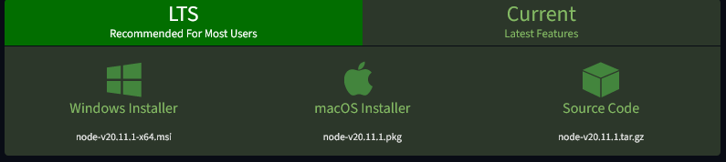
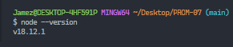
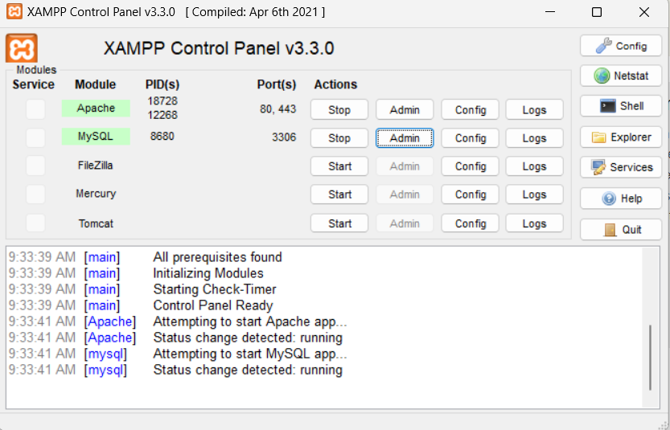
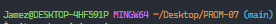

Project Instruction

To make this project run on your Local PC, you need to have the following prerequisites.

1. NodeJs. This is very important becasue React Runs on NodeJs. To download NodeJs on your ststem, use the following link: https://nodejs.org/en/download

   

   Once you download the latest version on your PC, make sure to install it and then, verify it if the installation was successful by running the following command:

   "node --version"

   This command will show you the version of nodeJs that you are currently running on your PC.

   You should see something like this:
   

   Good Job!!!

2. Xampp. This is very important becasue it would help us install MySql on our PC and Make viewing our database easier.
   You can download Xampp using the following link: https://www.apachefriends.org/download.html

   Once downloaded, install it using all the default settings and then run it.

   Make sure to start both Apache and MySql.

   Your Xampp should look like this:
   

   After doing this, go to your browser and visit:

   "http://localhost/phpmyadmin/"

   When it opens, create a new database named "prom07".

   Welldone!

IMPORTANT INFORMATION
Clone the project into your PC, After cloning the project into the PC, open the project on a code editor that you like and then, open the terminal. The Terminal must be pointing at the project directory i.e


Your terminal should look something like the above.

Go to the folder named "Frontend" using your terminal and run:

"npm install"

Open another terminal and go to the folder named "Backend" using your terminal then run:

"npm install"

This command would help install all the packages needed to run the Frontend and backend.

While in the Backend directory, run the following commands:

1. "npx sequelize-cli db:migrate" ---- This command would help you push all the tables you need to the database in MySql
2. "npx sequelize-cli db:seed:all" ---- This command would help you push all the initial data like users and roles data

In the same Backend directory, create a folder named "config.env"

Add tthe following lines of code to it:

```
NODE_ENV=development
JWT_SECRET=my-ultra-secure-and-ultra-long-secret
PORT=5000

JWT_EXPIRES_IN=90d
JWT_COOKIE_EXPIRES_IN=90
```

Immidiately this step is finished, do the following:

1. Go to the Frontend folder in your terminal and run: "npm start"
2. Go to the Backend folder in your terminal and run: "npn run dev"

Open your browser and paste the following url: http://localhost:3000/

Well Done!!!
